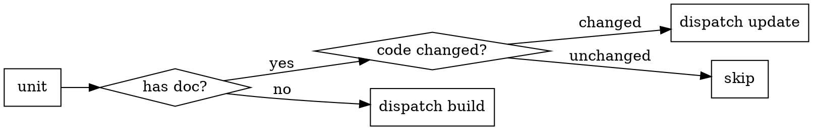

# arch-doc-orchestrate · Documentation tree orchestration

## Overview

Compose the base atoms (`arch-doc-build` / `arch-doc-update`) to build or refresh the WHAT of an entire project in batch, along an isomorphic, recursive documentation tree.

**Core principle**: You are the conductor, not the worker. You do not write documentation, fill WHY, perform reduction, change code, or assign weights. You do only four things: traverse, route, dispatch, stitch. The actual documentation for each unit is produced by a subagent running build or update. The output is the whole tree with WHAT filled and WHY all marked `⏳` — not a finished product (WHY is filled later by `arch-why-orchestrate`).

## When to use

- Building or refreshing an architecture documentation tree for an entire project or large subsystem in one batch.

**Do not use for**: a single document (use `arch-doc-build` / `arch-doc-update` directly), filling WHY (`arch-why-orchestrate`), or reviewing a spec (`arch-spec-review`).

## Workflow

1. **Overview first**: If there is no overview, dispatch `arch-doc-build` to build it first — its drill-down section table is the dispatch target list. Do not fan out without an overview (you have no targets to dispatch to).
2. **Read the drill-down section** to obtain the sub-unit list.
3. **Route each unit** (diagram above): no doc → build / has doc and code changed → update / unchanged → skip.
4. **Fan-out**: Dispatch subagents for sibling sub-units in parallel (each writes a different documentation file, with no shared state, so parallel execution is safe).
5. **Recursive drill-down**: After each sub-unit's build/update completes, read its drill-down section and repeat steps 2–4, descending level by level.
6. **Stitch phase (required, see below)**: Validate cross-reference consistency across the whole tree.

The entire process is agent-enforced, with no scripts.

## Decomposition and placement

Decomposition is driven entirely by the drill-down table's dedicated-document pointers (see `intent-contract` §5):

- **Dispatch targets**: only rows whose pointer is `to-be-written` (→ build a new child document) or a **link** whose code changed (→ update) are dispatched. Rows marked `—` (a one-line row suffices) and unchanged links are **never built**.
- **Recursion / termination**: descend through each new document's own `to-be-written` rows. The tree's depth and breadth are set by build's granularity judgment, not a fixed limit — recursion ends naturally when build plants no more `to-be-written`.
- **Placement** (per `intent-contract` "Document location and naming"): after a child's build returns, place it as a **directory** (`<n>-<child>/00-<name>.md`) if its drill-down table has any `to-be-written` rows, otherwise as a **single file** (`<n>-<child>.md`). Number siblings in drill-down-table order.
- **Soft depth/size guard**: before a large fan-out (a deep tree or a large number of new documents), surface the planned tree to the human for a sanity check first. This is a soft check, not a hard gate.

## Dispatching subagents

- **Self-contained**: Give each dispatch everything it needs — unit path/scope, the `arch-doc-build` or `arch-doc-update` SKILL to read, `../arch-docs-conventions/assets/template.md`, `../arch-docs-conventions/references/intent-contract.md`, the output document path, and the return-report contract. A subagent does not inherit your session history.
- **Shared contract**: All subagents read the same `intent-contract.md` — this is key to preventing multiple agents from diverging and causing contract drift.
- **File handoffs**: Have subagents write their documentation to files and their reports to files; do not let large outputs flood your context. You only read their short receipts.
- **Model selection**: Build/update work is mostly mechanical — use a cheap model to reduce cost and increase speed; upgrade only when a unit is especially complex.
- **Parallel safety**: Different documentation files may run in parallel; the same document must not. The overview must precede its sub-units (you need its drill-down section to know whom to dispatch).

## Determining whether code changed

- **Coarse routing**: Has doc = update candidate; no doc = build. Precise "did it change" is update's reconciliation work (if truly unchanged, it produces zero changes, equivalent to a skip).
- **Optional shortcut signal**: Use `git log` to check whether the unit's directory has changed since the document's last commit; for units that clearly have not changed, skip directly and save a dispatch. Worthwhile on large trees.

## Durable progress (avoid loss on large trees)

Use the ledger pattern from `subagent-driven-development`: a large tree may span compaction. Maintain a progress ledger file (which units are built/refreshed, with their document paths). After an interruption or compaction, recover from the ledger plus git, and do not re-dispatch units that are already complete.

## Stitch phase (required)

When multiple agents each run independently, a closing pass is required to prevent drift. Validate the tree invariants per `intent-contract` §5 (agent-enforced):

- Every drill-down section pointer resolves to a real child document, and the child's `<unit>` aligns with the pointer.
- Each child document is pointed to by exactly one parent (no orphans, no double-parents).
- **Cross-unit ownership**: If multiple drill-down sections point to the same sub-component, treat it as a stitch conflict. Choose one owning parent for the child document and demote the other drill-down rows to `—` or restructure the rows so each child document has exactly one parent; do not invent a reference pointer state.

## Output

- The whole documentation tree with WHAT filled and WHY all marked `⏳`.
- A consistency / stitch report.
- **Not a finished product**: WHY is filled later by `arch-why-orchestrate` (sequential interview of humans).

## Red flags — stop

- Fanning out without an overview (no dispatch targets).
- Orchestrate doing the work itself: writing WHAT, filling WHY, performing reduction, or assigning weights.
- Skipping the stitch phase (multiple agents will inevitably drift).
- Re-dispatching units the ledger marks complete.
- Stuffing the entire project's code into one subagent (split by unit instead).
- Letting multiple subagents edit the same document (serialize instead).

## Dependencies / integration

- **Dispatch**: `arch-doc-build` · `arch-doc-update`
- **Stitch basis**: `../arch-docs-conventions/references/intent-contract.md` §5
- **Next phase**: `arch-why-orchestrate` (fills WHY)
- **See also**: `superpowers:dispatching-parallel-agents` · `superpowers:subagent-driven-development`
